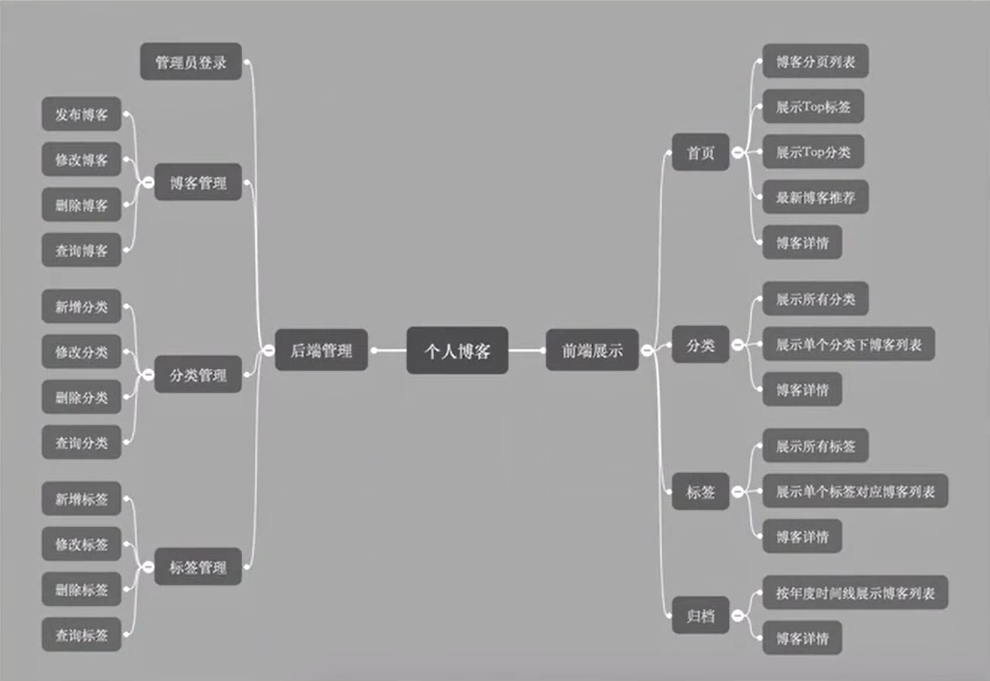

# http://cca.nuaa.edu.cn/2021/0913/c15648a261920/page.htmSpringboot 个人博客搭建

<font color=orange>个人博客导图功能：</font>


<font color=orange> 技术组合：</font>

- 后端：Spring Boot + JPA + thymeleaf模板
- 数据库：MySQL
- 前端UI：Semantic UI框架

<font color=orange>工具组合：</font>

- IDEA
- Maven
- JDK 8
- Axure RP 8(原型设计工具)

<font color=orange>课程模块：</font>

- 需求分析与功能规划
- 页面设计与开发
- 技术框架搭建
- 后端功能实现
- 前端功能实现

<font color=orange>学得内容：</font>

- 基于Spring boot的完整全栈式开发套路
- Semantic UI框架使用
- 一套博客系统的源代码与设计

## 1、需求与功能

用户故事：敏捷开发框架中的一种开发方法，是从用户角度描述需求

### 1.1 用户故事

用户故事模板：

- As a (role of user), I want (some feature) so that (some business value).
- 作为一个（某个角色）使用者，我可以做（某个功能）事情，如此可以有（某个商业价值）的好处

角色、功能、商业价值

举例：

- 作为一个招聘网站<font color=orange>注册用户</font>，我想<font color=orange>查看最近3天发布的招聘信息</font>，以便于<font color=orange>了解最新的招聘信息</font>。
- 作为公司，可以张贴新工作。

个人博客系统的用户故事：

角色：<font color=orange>普通访客、管理员（我）</font>

- 访客，可以分页查看所有的博客
- 访客，可以快速查找博客数量最多的6个分类
- 访客，可以查看所有的分类
- 访客，可以查看某个分类下的博客列表
- 访客，可以快速查看标记博客最多的10个标签
- 访客，可以查看所有的标签
- 访客，可以查看某个标签下的博客列表
- 访客，可以根据年度时间线查看博客列表
- 访客，可以快速查看最新的推荐博客
- 访客，可以用关键字全局搜索博客
- 访客，可以查看单个博客内容
- 访客，可以对博客内容进行评论
- 访客，可以赞赏博客内容
- 访客，可以微信扫描阅读博客内容
- 访客，可以在首页扫描公众号二维码关注我
- 我，可以用户名和密码登录后台管理
- 我，可以管理博客
  - 我，可以发布新博客
  - 我，可以对博客进行分类
  - 我，可以对博客打标签
  - 我，可以修改博客
  - 我，可以删除博客
  - 我，可以根据标题、分类、标签查询博客
- 我，可以管理博客分类
  - 我，可以新增一个分类
  - 我，可以修改一个分类
  - 我，可以删除一个分类
  - 我，可以根据分类名称查询分类
- 我，可以管理标签
  - 我，可以新增一个标签
  - 我，可以修改一个标签
  - 我，可以删除一个标签
  - 我，可以根据名称查询标签

### 1.2 功能规划



## 2、页面设计与开发

### 2.1 设计

> axure RP8 原型设计


前端展示：首页、详情页、分类、标签、归档、关于我

后端管理：模板页

### 2.2页面开发

> Semantic UI框架
>
> WebStorm前端开发工具

Semantic UI官网

Semantic UI中文官网

WebStorm下载与破解

背景图片资源

### 2.3插件集成

[编辑器Markdown](https://pandao.github.io/editor.md/)

[内容排版typo.css](https://github.com/sofish/typo.css)

[动画 abimate.css](https://daneden.github.io/animate.css)

[代码高亮 prism](https://github.com/PrismJS/prism):参考https://www.bilibili.com/video/BV1nE411r7TF?p=17

[滚动侦测 waypoints](http://imakewebthings.com/waypoints/)

[平滑滚动 jquery.scrollTo](https://github.com/flesler/jquery.scrollTo)

[目录生成 Tocbot](https://tscanlin.github.io/tocbot/)

[二维码生成 qrcode.js](https://davidshimjs.github.io/qrcodejs)

## 3.框架搭建


> IDEA下载：https://www.jetbrains.com/idea/
>
> 李仁密：spring boot入门与进阶

### 3.1 构建与配置

**1. 引入Spring Boot模块**

- web
- Thymeleaf
- JPA
- MySQL
- Aspects
- DevTools

**2. application.yml配置**

- 使用thymeleaf 3

  pom.xml:

  ```xml
  <thymeleaf.version>3.0.9.RELEASE</thymeleaf.version>
  <thymeleaf-layout-dialect.version>2.1.1</thymeleaf-layout-dialect.version>
  ```

  application.yml:

  ```yml
  spring:
  	thymeleaf:
  		mode: HTML
  ```

- 数据库连接配置

  ```yml
  spring:
  	datasource:
  		driver-class-name: com.mysql.jdbc.Driver
  		url: jdbc:mysql://localhost:3306/blog?useUnicode=true&characterEncoding=utf-8
  		username:root
  		password:root
  	jpa:
  		hibernate:
  			ddl-auto:update
  		show-sql : true
  ```

- 日志配置

  application.yml

  ```yml
  logging:
    level:
  	root: info
  	com.imcoding: debug
    file: log/imcoding.log
  ```

  logback-spring.xml:

  ```xml
  <?xml version="1.0" encoding="UTF-8" ?>
  <configuration>
      <!--包含了Spring boot对logback日志的默认配置-->
      <include resource="org/springframework/boot/logging/logback/defaults.xml"/>
      <property name="LOG_FILE" value="${LOG_FILE:-${LOG_PATH:-${LOG_TEMP:-${java.io.tmpdir:-/tmp}}}/spring.log}" />
      <include resource="org/springframework/boot/logging/logback/console-appender.xml" />
  
      <!--重写了Spring Boot框架 org/springframework/boot/logging/logback/file-appender.xml 配置 -->
      <appender name="TIME_FILE" class="ch.qos.logback.core.rolling.RollingFileAppender">
          <encoder>
              <pattern>${FILE_LOG_PATTERN}</pattern>
          </encoder>
          <file>${LOG_FILE}</file>
          <rollingPolicy class="ch.qos.logback.core.rolling.TimeBasedRollingPolicy">
              <fileNamePattern>${LOG_FILE}.%d{yyyy-MM-dd}.%i</fileNamePattern>
              <!--保留历史日志一个月时间-->
              <maxHistory>30</maxHistory>
              <!--Spring Boot默认情况下，日志文件10M时，会切分日志文件，这样设置日志文件会在100M时切分日志-->
              <timeBasedFileNamingAndTriggeringPolicy class="ch.qos.logback.core.rolling.SizeAndTimeBasedFNATP">
                  <maxFileSize>10MB</maxFileSize>
              </timeBasedFileNamingAndTriggeringPolicy>
          </rollingPolicy>
      </appender>
  
      <root level="INFO">
          <appender-ref ref="CONSOLE" />
          <appender-ref ref="TIME_FILE" />
      </root>
  </configuration>
  
  <!--
      1.继承Spring boot logback设置（可以在application.yml或application.properties设置logging.*属性）
      2.重写了默认配置，设置日志文件大小在100MB时，按照日期切分日志，切分后目录：
  
          my.2017-08-01.0  80MB
          my.2017-08-01.1  10MB
          my.2017-08-02.0  56MB
          my.2017-08-03.0  53MB
  -->
  ```

  

- 生产环境与开发环境配置

  - application-dev.yml
  - application-pro.yml

### 3.2 异常处理

1、定义错误页面

- 404	-资源找不到或访问页面不存在
- 500        -后台Spring boot产生异常信息
- error      -自定义错误页面，输入错误信息，隐藏在页面上，便于开发者调试使用，发生异常可查看

2、全局处理异常

统一处理异常：

```java
@ControllerAdvice   //拦截掉所有标注注有@Controller注解的控制器
public class ControllerExceptionHandler {

    //获取日志
    private final Logger logger = LoggerFactory.getLogger(this.getClass());

    @ExceptionHandler(Exception.class)     //标识该方法可以做异常处理,拦截级别为所有Exception
    public ModelAndView ExceptionHander(HttpServletRequest request, Exception e) {

        logger.error("Request URL : {} , Exception : {}",request.getRequestURI(), e);
        
        //查找第一个参数类中，是否涵盖ResponseStatus注解。如果有，就返回此注解，没有就返回空
        if (AnnotationUtils.findAnnotation(e.getClass(), ResponseStatus.class) != null){
            throw e;
        }
        
        ModelAndView mv = new ModelAndView();
        mv.addObject("url", request.getRequestURI());
        mv.addObject("exception", e);
        mv.setViewName("error/error");   //error目录下的error页面
        return mv;
    }
}

```

错误页面异常信息显示处理：

```html
<div>
    <div th:utext="'&lt;!=='" th:remove="tag"></div>
    <div th:utext="'Failed Request URL : ' + ${url}" th:remove="tag"></div>
    <div th:utext="'Exception message : ' + ${exception.message}" th:remove="tag"></div>
    <ul th:remove="tag">
        <li th:each="st : ${exception.stackTrace}" th:remove="tag"><span th:utext="${st}" th:remove="tag"></span></li>
    </ul>
    <div th:utext="'--&gt;'" th:remove="tag"></div>
</div>
```

3、资源找不到异常

```java
@ResponseStatus(HttpStatus.NOT_FOUND)       //指定返回的状态码，NOT_FOUND状态代表它将会将这个Exception最后作为资源找不到的状态，从而springboot获取到该状态会加载返回404页面
public class NotFoundException extends RuntimeException{

    public NotFoundException() {

    }

    public NotFoundException(String message) {
        super(message);
    }

    public NotFoundException(String message, Throwable cause) {
        super(message, cause);
    }
}
```

### 3.3 日志处理

1、记录日志内容

- 请求url
- 访问者ip
- 调用方法 classMethod
- 参数args
- 返回内容

2、记录日志类

```java
@Aspect         //切面，进行切面操作
@Component      //开启组件扫描
public class LogAspect {

    private final Logger logger = LoggerFactory.getLogger(this.getClass());//日志记录器

    /**@Pointcut声明该方法为一个切面  execution()规定拦截哪些类
     * '* com.sinocifengs.blog.web.*.*(..)'
     *  任何类(public/private等)“*”  在“com.sinocifengs.blog.web”路径下  所有的类下的方法“*.*()” 方法参数为任何参数“*()”  * */
    @Pointcut("execution(* com.sinocifengs.blog.web.*.*(..))")
    public void log() {
    }

    @Before("log()")    //在log()方法切面之前执行，具体到这里，针对web文件夹下的所有控制器，只要有请求发过来，都会在请求方法返回之前执行这一方法
    public void doBefore(JoinPoint joinPoint) {
        ServletRequestAttributes attributes = (ServletRequestAttributes) RequestContextHolder.getRequestAttributes();
        HttpServletRequest request = attributes.getRequest();
        String url = request.getRequestURI();
        String ip = request.getRemoteAddr();
        String classMethod = joinPoint.getSignature().getDeclaringTypeName()+"."+joinPoint.getSignature().getName();//类名.方法名
        Object[] args = joinPoint.getArgs();
        RequestLog requestLog = new RequestLog(url, ip, classMethod, args);

        logger.info("Request : {}", requestLog);
    }
    @After("log()")
    public void doAfter() {
        logger.info("-----------doAfter-----------");
    }
    @AfterReturning(returning = "result",pointcut = "log()")           //通过Object result参数捕获切面log()返回的内容
    public void doAfterReturn(Object result) {       //方法执行完成返回后进行拦截
        logger.info("Result : {}" , result);
    }
    private class RequestLog{
        private String url;
        private String ip;
        private String classMethod; //调用方法
        private Object[] args;      //请求参数

        public RequestLog(String url, String ip, String classMethod, Object[] args) {
            this.url = url;
            this.ip = ip;
            this.classMethod = classMethod;
            this.args = args;
        }

        @Override
        public String toString() {
            return "{" +
                    "url='" + url + '\'' +
                    ", ip='" + ip + '\'' +
                    ", classMethod='" + classMethod + '\'' +
                    ", args=" + Arrays.toString(args) +
                    '}';
        }
    }
}
```

### 3.4 页面处理

1. 静态页面导入project
2. thymeleaf布局
   - 定义fragment
   - 使用fragment布局~
3. 错误页面美化

## 4. 设计与规范

### 4.1 实体设计

`实体类:`

- 博客Blog
- 博客分类Type
- 博客标签Tag
- 博客评论Comment
- 用户User

`实体关系：`


`评论类自关联关系：`


`Blog类：`


`Type类`


`Tag类：`


`Comment类：`


`User类：`


### 4.2 应用分层


### 4.3 命名约定

`Service/DAO层命名约定：`

- 获取单个对象的方法用get做前缀
- 获取多个对象的方法用list做前缀
- 获取统计值的方法用count做前缀
- 获取单个对象的方法用get做前缀
- 插入的方法用save(推荐)或insert做前缀
- 删除的方法用remove(推荐)或delete做前缀
- 修改的方法用update做前缀

## 5. 后台管理

 

### 5.1 登录

**1、构建登录页面与后台管理首页**

**2、UserService与UserRepository**

**3、LoginController实现登录**

**4、MD5加密**

**5、登录拦截器**

### 5.2 分类管理

**1、分类器管理页面**

**2、分类列表分页**

Pageable对象内容：

```javascript
{
"content":[
{"id":123,"title":"blog122","content":"this is blog content"},
{"id":122,"title":"blog121","content":"this is blog content"},
{"id":121,"title":"blog120","content":"this is blog content"},
{"id":120,"title":"blog119","content":"this is blog content"},
{"id":119,"title":"blog118","content":"this is blog content"},
{"id":118,"title":"blog117","content":"this is blog content"},
{"id":117,"title":"blog116","content":"this is blog content"},
{"id":116,"title":"blog115","content":"this is blog content"},
{"id":115,"title":"blog114","content":"this is blog content"},
{"id":114,"title":"blog113","content":"this is blog content"},
{"id":113,"title":"blog112","content":"this is blog content"},
{"id":112,"title":"blog111","content":"this is blog content"},
{"id":111,"title":"blog110","content":"this is blog content"},
{"id":110,"title":"blog109","content":"this is blog content"},
{"id":109,"title":"blog108","content":"this is blog content"}],
"last":false,（是否最后一页）
"totalPages":9,（最多几页）
"totalElements":123,（总数据条数）
"size":15,（一页数据有多少条）
"number":0,（当前页）
"first":true,（是否为第一页）
"sort":[{	排序
"direction":"DESC",
"property":"id",
"ignoreCase":false,
"nullHandling":"NATIVE",
"ascending":false
}],
"numberOfElements":15 （当前页数据占总数据的多少条）
}
```

**3、分类新增、修改、删除**

>遇到问题：
>
>在原本po层
>
>```java
>@Id
>@GeneratedValue
>private Long id;
>```
>
>默认为auto方式自增，id为主键，出现插入Mysql数据库时，id为null无法插入
>
>最终解决方法（第一次）
>
>```java
>@Id
>@GeneratedValue(strategy=GenerationType.IDENTITY)
>private Long id;
>```
>
>同时，将原本mysql数据库中表全部删除，重启项目，重新生成相关表
>
>最终解决方法（第二次发生）
>
>po层的id为Long，而get和set方法中为long类型，将其中long修改为Long即可解决（参考如下解决方法）。
>
>https://stackoverflow.com/questions/25234892/org-springframework-beans-invalidpropertyexception-invalid-property-id-of-bea/25235148

### 5.3 标签管理

同5.2

### 5.4 博客管理

**1、博客分页查询**

**2、博客新增**

**3、博客修改**

**4、博客删除**

## 6.前端展示

### 6.1 首页展示

1、博客列表

2、top分类

3、top标签

4、最新博客推荐

5、博客详情

1. Markdown转换HTML

   * [commonmark-java](https://github.com/atlassian/commonmark-java)

   * pom.xml引用commonmark和扩展插件

     ```xml
             <dependency>
                 <groupId>com.atlassian.commonmark</groupId>
                 <artifactId>commonmark</artifactId>
                 <version>0.17.0</version>
             </dependency>
             <dependency>
                 <groupId>com.atlassian.commonmark</groupId>
                 <artifactId>commonmark-ext-heading-anchor</artifactId>
                 <version>0.17.0</version>
             </dependency>
             <dependency>
                 <groupId>com.atlassian.commonmark</groupId>
                 <artifactId>commonmark-ext-gfm-tables</artifactId>
                 <version>0.17.0</version>
             </dependency>
     ```

     

2. 评论功能

   - 评论信息提交与回复功能

     注释：<script th:inline="javascript">，这样javascript中的thymleaf中内容才会被识别到

   - 评论信息列表展示功能

   - 管理员回复评论功能

### 6.2 分类页

### 6.3 标签页

### 6.4 归档页

1. 查询博客包含多少个年份

   ```sql
   SELECT date_format(b.update_time, '%Y') as year from t_blog b GROUP by year ORDER BY year DESC; 
   ```

2. 根据每个年份查询数据列表

   ```sql
   SELECT * from t_blog b where date_format(b.update_time, '%Y') = '2020';
   ```

**报错归纳：**

>org.springframework.beans.factory.UnsatisfiedDependencyException: Error creating bean with name 'blogServiceImpl': Unsatisfied dependency expressed through field 'blogRepository'; nested exception is org.springframework.beans.factory.BeanCreationException: Error creating bean with name 'blogRepository' defined in com.sinocifengs.blog.dao.BlogRepository defined in @EnableJpaRepositories declared on JpaRepositoriesRegistrar.EnableJpaRepositoriesConfiguration: Invocation of init method failed; nested exception is java.lang.IllegalArgumentException: Validation failed for query for method public abstract java.util.List com.sinocifengs.blog.dao.BlogRepository.findGroupYears()!
>	at ....
>
>Caused by: org.springframework.beans.factory.BeanCreationException: Error creating bean with name 'blogRepository' defined in com.sinocifengs.blog.dao.BlogRepository defined in @EnableJpaRepositories declared on JpaRepositoriesRegistrar.EnableJpaRepositoriesConfiguration: Invocation of init method failed; nested exception is java.lang.IllegalArgumentException: Validation failed for query for method public abstract java.util.List com.sinocifengs.blog.dao.BlogRepository.findGroupYears()!
>
>错误原因：
>
>```sql
>@Query("select b from Blog b where function('date_format', b.update_Time, '%Y') = ?1")
>```
>**错写为**
>
>```sql						
>@Query("select b from Blog b where function('date_format', b.updateTime, '%Y') = ?1")
>```

### 6.5 关于我

### 6.6 关于国际化

> https://www.bilibili.com/video/BV1nE411r7TF?p=47 大概从20min开始

中文：message_zh_CN.properties

英文：message_en_US.properties

## 7.代码中存在的问题


### 7.1  **报错归纳1：**

> org.springframework.beans.factory.UnsatisfiedDependencyException: Error creating bean with name 'blogServiceImpl': Unsatisfied dependency expressed through field 'blogRepository'; nested exception is org.springframework.beans.factory.BeanCreationException: Error creating bean with name 'blogRepository' defined in com.sinocifengs.blog.dao.BlogRepository defined in @EnableJpaRepositories declared on JpaRepositoriesRegistrar.EnableJpaRepositoriesConfiguration: Invocation of init method failed; nested exception is java.lang.IllegalArgumentException: Validation failed for query for method public abstract java.util.List com.sinocifengs.blog.dao.BlogRepository.findGroupYears()!
> 	at ....
>
> Caused by: org.springframework.beans.factory.BeanCreationException: Error creating bean with name 'blogRepository' defined in com.sinocifengs.blog.dao.BlogRepository defined in @EnableJpaRepositories declared on JpaRepositoriesRegistrar.EnableJpaRepositoriesConfiguration: Invocation of init method failed; nested exception is java.lang.IllegalArgumentException: Validation failed for query for method public abstract java.util.List com.sinocifengs.blog.dao.BlogRepository.findGroupYears()!
>
> 错误原因：
>
> ```sql
> @Query("select b from Blog b where function('date_format', b.update_Time, '%Y') = ?1")
> ```
>
> **错写为**
>
> ```sql						
> @Query("select b from Blog b where function('date_format', b.updateTime, '%Y') = ?1")
> ```

### 7.2**报错归纳2：**

```
//获取最新的size条blog数据
List<Blog> listRecommendBlogTop(Integer size);
```

当早期数据库中文章较少时，小于size，则会报错（栈溢出），后果为thymleaf模板被打破，再footer中再引入本来就有的footer