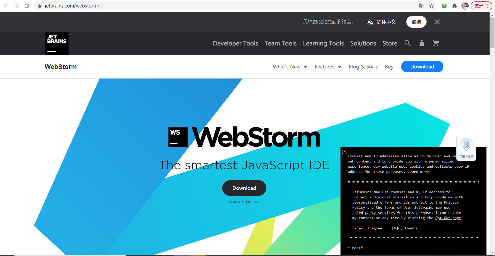
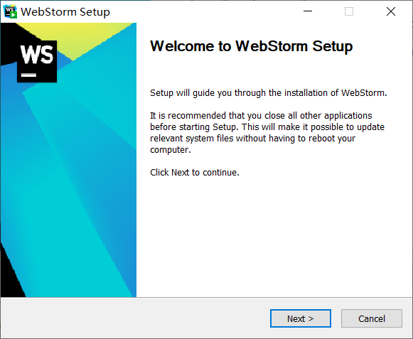
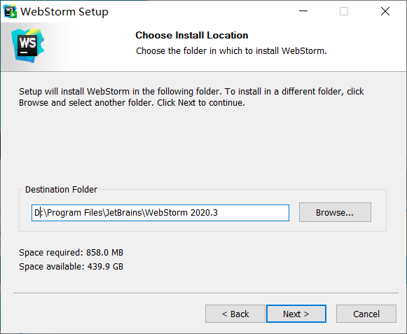
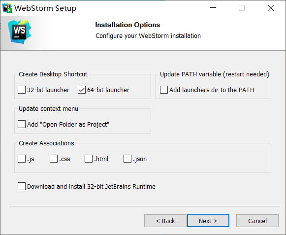
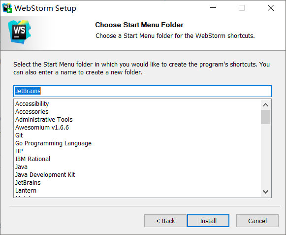
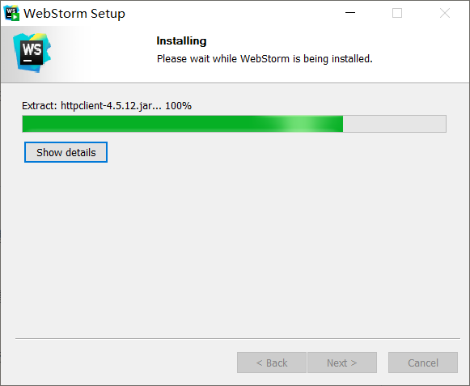
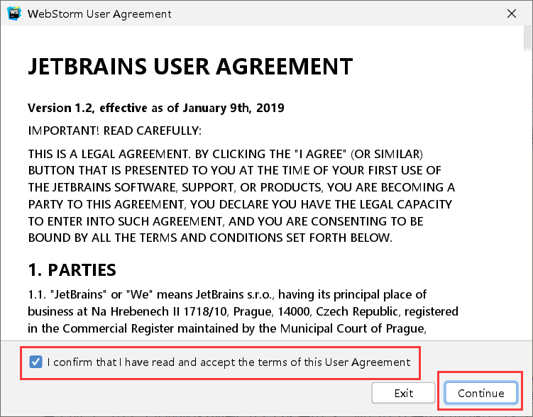
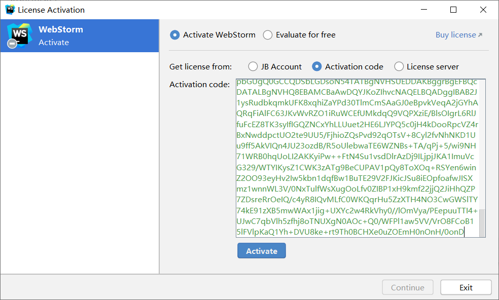
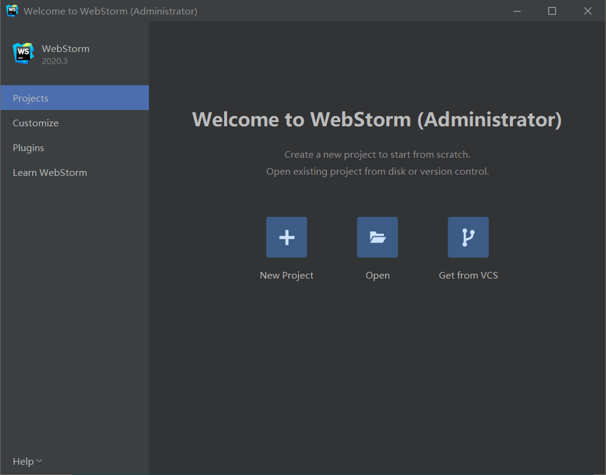

# WebStorm前端开发工具安装教程

## 安装

1. 去官网下载正版安装包，官网地址：http://www.jetbrains.com/webstorm/

   

2. 开始安装

   

3. 选择安装路径

   

4. Create Desktop Shortcut指是否创建桌面快捷方式；Create Associations中.js .css .html勾选后之后js css html文件默认会用webstorm打开

   

5. 正常安装

   

   

   

6. 运行

   

## 破解

破解码可自行寻找（http://idea.medeming.com/jetbrains/?from=singlemessage&isappinstalled=0）

