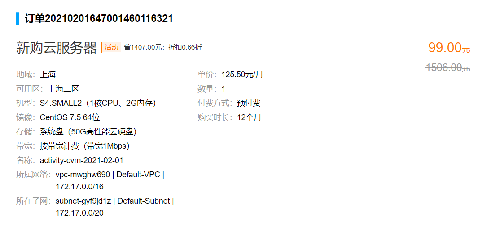
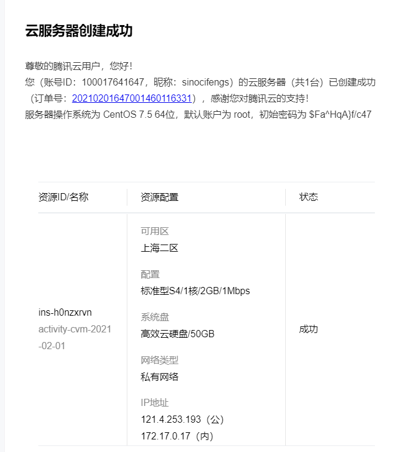
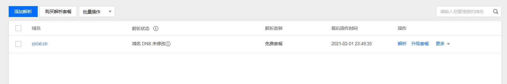

# blog-web项目部署

## 1.关于jar包和war包

见https://www.jianshu.com/p/3b5c45e8e5bd

## 2. jar包方式部署

通过maven生成jar包：https://www.cnblogs.com/Guhongying/p/10847321.html

## 3. war包方式部署

通过idea生成war包：https://www.cnblogs.com/zou-zou/p/9661432.html

通过idea打包springboot项目的war包：https://blog.csdn.net/qq_34575174/article/details/89219540

## 4. 软件安装

1. mysql5.7：https://www.jianshu.com/p/276d59cbc529

## 5. 网站搭建

https://www.bilibili.com/video/av89921513/?spm_id_from=333.788.b_636f6d6d656e74.75https://www.jianshu.com/p/8ab4f3468304?utm_campaign=maleskine&utm_content=note&utm_medium=seo_notes&utm_source=recommendation

https://www.bilibili.com/video/av89921513/?spm_id_from=333.788.b_636f6d6d656e74.75

https://www.bilibili.com/video/BV164411m7N8?p=11&spm_id_from=pageDriver

密码：1459736568Tao

域名：鱼游晨曦里

域名管理：https://console.cloud.tencent.com/domain

SSL证书管理：https://console.cloud.tencent.com/certoverview

云服务器控制台：https://console.cloud.tencent.com/cvm/instance/index?rid=4

教程：https://www.jianshu.com/p/8ab4f3468304?utm_campaign=maleskine&utm_content=note&utm_medium=seo_notes&utm_source=recommendation